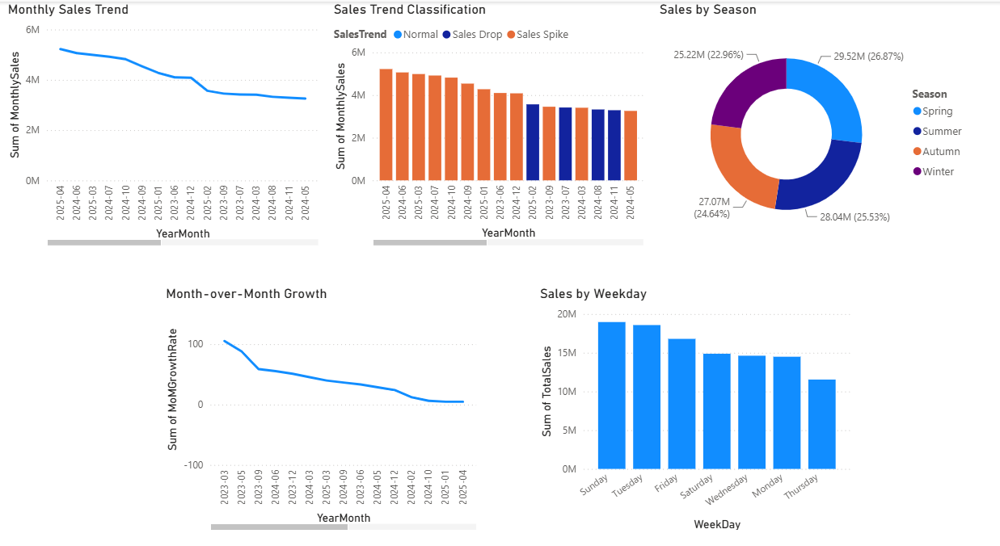
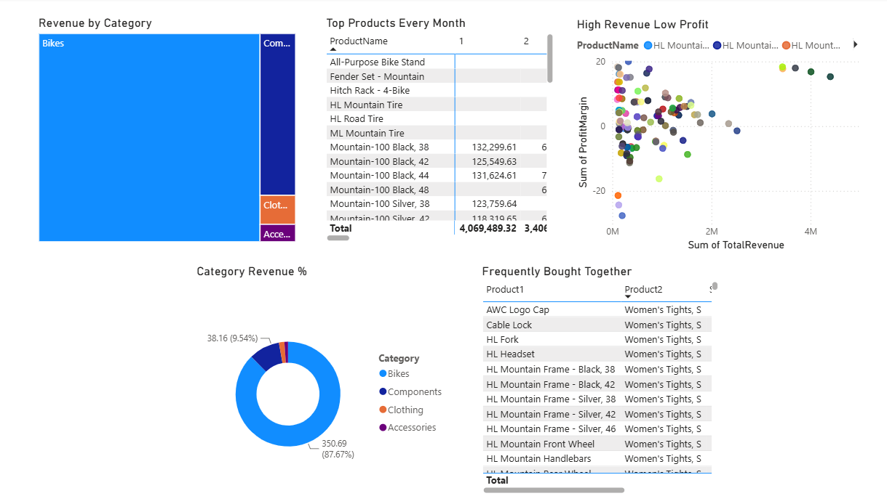
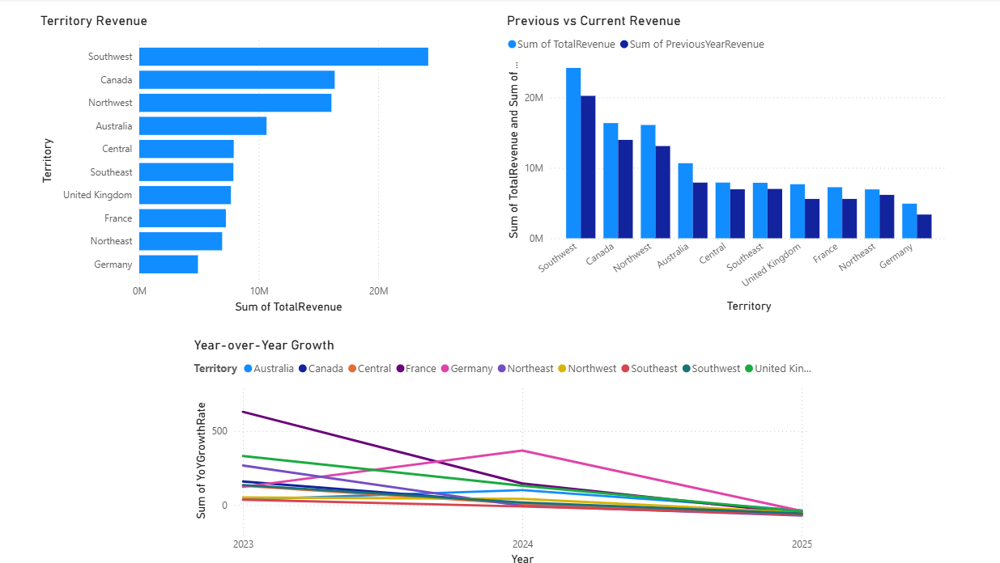
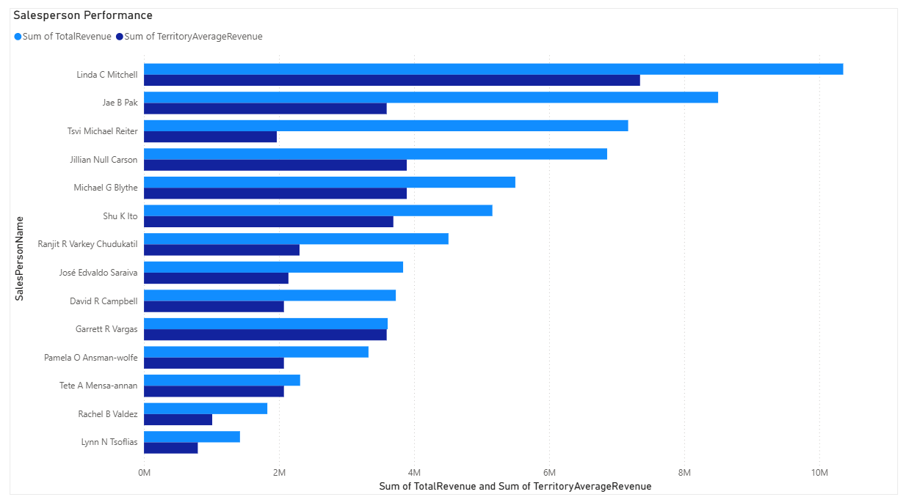
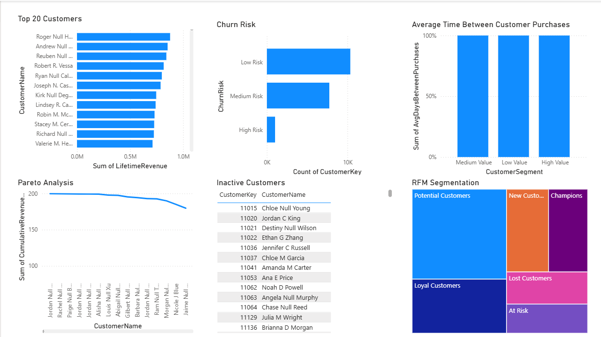
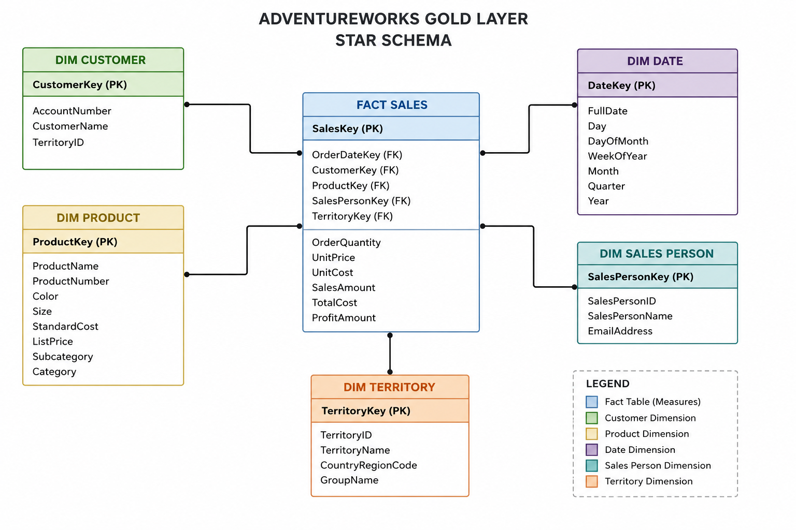
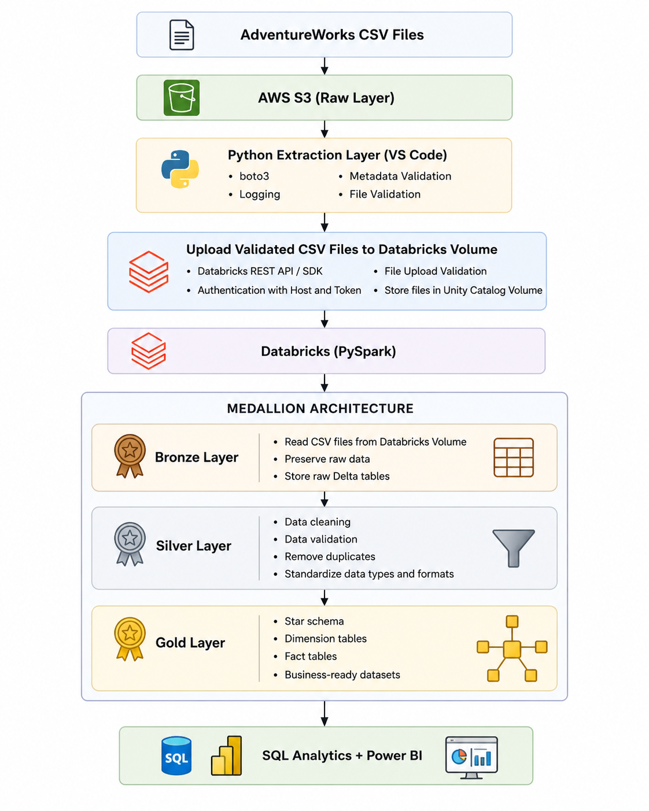
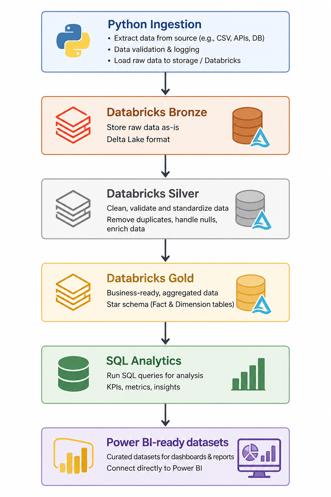

# AdventureWorks Sales Analytics Platform

**SQL · Power BI · Python · Databricks · PySpark · AWS S3 · Apache Airflow**

## Project Overview

**Adventure Works Cycles** is the fictional bicycle manufacturer and retailer represented in Microsoft's AdventureWorks dataset.

The company sells **bicycles, components, clothing, and accessories** across multiple geographic territories through a network of customers and sales representatives.

### Business Problem

Adventure Works had detailed operational data covering **sales orders, customers, products, salespeople, and territories**, but this information was distributed across multiple tables.

This made it difficult for management to answer fundamental commercial questions:

- What is driving revenue?
- When are sales strongest?
- Which products generate the most value?
- Who are the company's most valuable customers?
- Which customers are at risk of becoming inactive?
- Which territories are performing best?
- Which salespeople outperform their regional benchmarks?

### Solution

I built an **end-to-end analytics platform** that transforms the raw operational data into an analytics-ready Star Schema, applies business-focused SQL analysis, and presents the results through six Power BI dashboards.

```text
AdventureWorks Data
        ↓
      AWS S3
        ↓
 Python Ingestion
        ↓
    Databricks
Bronze → Silver → Gold
        ↓
   Star Schema
        ↓
  SQL Analytics
        ↓
     Power BI
        ↓
 Business Insights
```

The complete workflow is orchestrated with **Apache Airflow**.

---

# Key Business Findings

## 1. Sales show clear seasonal and weekly patterns



The analysis revealed meaningful differences in sales depending on both the season and day of the week.

### Findings

- **Spring was the strongest season**, generating **$29.52M (26.87%)** of sales.
- Summer generated **$28.04M (25.53%)**.
- Autumn generated **$27.07M (24.64%)**.
- **Winter was the weakest season**, with **$25.22M (22.96%)**.
- **Sunday and Tuesday were the strongest sales days**.
- **Thursday showed the lowest sales volume** among the weekdays analyzed.
- Monthly analysis also revealed periods of both sales acceleration and decline.

### Business Implication

Adventure Works can use these patterns to better align **inventory, promotions, sales targets, and commercial activity** with periods of historically stronger or weaker demand.

---

## 2. Revenue is heavily concentrated in bicycles



Product analysis shows that Adventure Works' revenue depends heavily on its core bicycle business.

### Findings

- **Bikes generate approximately 87.7% of product-category revenue.**
- **Components contribute approximately 9.5%.**
- Clothing and Accessories represent only a small portion of total product revenue.
- The analysis identifies the highest-performing products by month.
- Several product combinations appear repeatedly in the **Frequently Bought Together** analysis.
- Revenue-versus-profit analysis identifies products that generate substantial revenue without producing equally strong margins.

### Business Implication

Bicycles are clearly the company's primary revenue engine.

At the same time, the much smaller contribution from accessories and clothing suggests opportunities to increase **cross-selling and basket size**, while high-revenue/low-margin products deserve additional pricing and profitability analysis.

---

## 3. Southwest is the strongest sales territory



Sales performance varies substantially across geographic markets.

### Findings

- **Southwest is the largest territory**, generating approximately **$24M in revenue**.
- **Canada and Northwest** form the next strongest group at approximately **$16M each**.
- Australia follows at approximately **$11M**.
- Germany is the lowest-revenue territory among those analyzed.
- Current revenue is higher than previous-year revenue across the territories shown in the comparison.
- Year-over-year analysis reveals substantial differences in growth trajectories between markets.

### Business Implication

Adventure Works should not manage all markets identically.

Southwest represents a critical revenue market, while lower-volume territories can be investigated for **growth opportunities, commercial constraints, or differences in customer demand**.

---

## 4. Sales performance is concentrated among several top representatives



Salespeople were evaluated not only by total revenue but also against the average performance of their respective territories.

### Findings

- **Linda C. Mitchell is the highest-revenue salesperson**, generating approximately **$10.3M**.
- **Jae B. Pak** follows at approximately **$8.5M**.
- **Tsvi Michael Reiter** generated approximately **$7.2M**.
- **Jillian Carson** also ranks among the strongest performers at approximately **$6.8M**.
- Several leading salespeople substantially outperform their territory averages.

### Business Implication

Comparing representatives against their **territory benchmark** provides a fairer performance measure than total revenue alone.

The strongest representatives can be studied to identify successful sales practices that could potentially be replicated across the organization.

---

## 5. Customer value is unevenly distributed



Customer-level analysis reveals significant differences in lifetime value and engagement.

### Findings

- The highest-value individual customer generated **close to $0.9M in lifetime revenue**.
- Several of the top customers generated more than **$0.7M each**.
- The Pareto analysis shows that customer revenue contribution is not evenly distributed.
- Most customers fall into **Low Risk or Medium Risk** churn categories.
- The **High Risk** group is considerably smaller.
- The analysis also identifies customers who have become inactive and may require re-engagement.

### Business Implication

Adventure Works can prioritize retention efforts based on both **customer value and churn risk**, rather than treating every customer equally.

High-value customers showing declining engagement should receive particular attention.

---

## 6. RFM segmentation creates actionable customer groups


I used **RFM analysis — Recency, Frequency, and Monetary Value —** to segment customers according to their purchasing behavior.

Customers were classified into groups including:

- Champions
- Loyal Customers
- Potential Customers
- New Customers
- At Risk
- Lost Customers

### Findings

- **Potential Customers represent the largest customer segment.**
- **Loyal Customers form another major portion of the customer base.**
- Champions represent a smaller but strategically valuable customer group.
- At-Risk and Lost Customers provide clearly identifiable populations for retention and reactivation efforts.
- Revenue differs substantially between customer segments.

### Business Implication

Instead of using the same strategy for every customer, Adventure Works can develop segment-specific actions:

**Champions →** loyalty and VIP programs  
**Loyal Customers →** cross-selling and retention  
**Potential Customers →** encourage repeat purchases  
**New Customers →** onboarding and second-purchase campaigns  
**At Risk →** targeted retention campaigns  
**Lost Customers →** reactivation campaigns

---

# From Business Problem to Solution

The project transformed fragmented operational data into a centralized analytical environment:

| Business Problem | Analytical Solution |
|---|---|
| Difficult to understand sales trends | Monthly, seasonal and weekday sales analysis |
| Limited visibility into customer value | Customer lifetime revenue and Pareto analysis |
| No behavioral customer segmentation | RFM segmentation |
| Difficult to identify retention opportunities | Churn-risk and inactive-customer analysis |
| Limited understanding of product contribution | Category and product revenue analysis |
| Cross-selling opportunities unclear | Frequently Bought Together analysis |
| Regional performance difficult to compare | Territory revenue and YoY analysis |
| Salespeople difficult to benchmark fairly | Salesperson vs. territory-average analysis |

---

# Data Model

I transformed the operational data into an analytics-ready **Star Schema** designed for SQL analysis and Power BI reporting.



The dimensional model provides consistent customer, product, territory, salesperson, and date dimensions for business analysis.

---

# Architecture



The analytics platform follows a modern cloud architecture:

**AWS S3 → Python → Databricks → PySpark → Delta Lake → SQL → Power BI**

Databricks implements a **Medallion Architecture**:

- **Bronze:** raw source data
- **Silver:** cleaned and standardized data
- **Gold:** analytics-ready Star Schema

The complete workflow is orchestrated using **Apache Airflow**.



---

# SQL Analysis

The analytical layer includes SQL models for:

- Monthly revenue trends
- Month-over-month growth
- Seasonal sales analysis
- Customer lifetime value
- Customer churn risk
- Inactive customers
- RFM segmentation
- Customer segment progression
- Product category contribution
- Top products by month
- Frequently purchased products
- High-revenue / low-margin products
- Territory year-over-year growth
- Salesperson vs. territory performance

### SQL Techniques

`CTEs` · `Window Functions` · `LAG()` · `LEAD()` · `DENSE_RANK()` · `NTILE()` · `CASE` · `Self Joins` · `Subqueries` · `Aggregations` · `Date Functions`

---

# Technology Stack

| Area | Technologies |
|---|---|
| Data Analysis | SQL, Power BI |
| Data Visualization | Power BI |
| Data Modeling | Star Schema, Dimensional Modeling |
| Programming | Python |
| Data Processing | PySpark |
| Cloud Storage | AWS S3 |
| Data Platform | Databricks |
| Storage | Delta Lake |
| Orchestration | Apache Airflow |
| Version Control | Git, GitHub |

---

# Repository Structure

```text
AdventureWorks/
│
├── airflow/
│   └── dags/
│       └── adventureworks_pipeline.py
│
├── config/
│
├── data/
│   └── raw/
│
├── databricks/
│   ├── 01_bronze.py
│   ├── 02_silver.py
│   ├── 03_gold.py
│   └── 04_sql_analytics.py
│
├── docs/
│   ├── architecture/
│   └── dashboards/
│
├── ingestion/
│   ├── run_pipeline.py
│   └── scripts/
│
├── powerbi/
│   └── AdventureWorksDashboard.pbix
│
├── scripts/
├── .gitignore
├── README.md
└── requirements.txt
```

---

# Skills Demonstrated

### Data Analytics & BI

- SQL business analysis
- Power BI dashboard development
- KPI analysis
- Trend and growth analysis
- Customer lifetime value
- Churn analysis
- RFM segmentation
- Product performance analysis
- Territory analysis
- Salesperson benchmarking
- Data visualization and storytelling

### Data Engineering

- Python ETL
- AWS S3
- Databricks
- PySpark
- Delta Lake
- Medallion Architecture
- Apache Airflow
- Star Schema modeling

---

# Project Outcome

Adventure Works' fragmented operational data was transformed into a **centralized analytics platform with six decision-focused Power BI dashboards**.

The analysis showed that:

- **Spring is the strongest sales season at $29.52M**
- **Bikes account for approximately 87.7% of product-category revenue**
- **Southwest is the strongest sales territory at approximately $24M**
- **Linda C. Mitchell leads salesperson revenue at approximately $10.3M**
- **Potential and Loyal Customers represent the largest RFM customer groups**
- Most customers are currently classified as **Low or Medium churn risk**

The final solution allows commercial performance to be analyzed across:

**Sales → Customers → Segments → Products → Territories → Salespeople**

This project demonstrates how **SQL and Power BI can transform operational data into actionable business recommendations**, supported by an automated cloud data pipeline.
